# 需求规格说明书

## 团队名称： 基于OpenGL的3D场景编辑器和基于CUDA并行加速的光线追踪渲染器 

## 完成时间： 2019.11.17

## 修订历史记录

| 日期       | 版本 | 说明                           |                       作者 |
| ---------- | ---- | ------------------------------ | -------------------------: |
| 2019.11.17 | V1.0 | 根据项目设想生成。 | 邱江、喻顺河、孙飞、陈项中 |
| 2019.11.22 | V1.1 | 进一步完善。 | 张永康 |
| 2019.12.1 | V1.2 | 进一步完善。 | 张永康 |
| 2019.12.3 | V1.3 | 修改一些错误 | 邱江 |

## 1.引言

### 1.1目的

该文档首先给出项目的整体结构和功能结构概貌，试图从总体架构上给出整个系统的轮廓。同时对功能需求、性能需求进行了详细的描述。便于用户、开发人员进行理解和交流，反映出用户问题的结构，可以作为软件开发工作的基础和依据以及确认测试和验收的依据。

本文档面向多种读者对象：

（1）项目经理：项目经理可以根据该文档了解预期产品的功能，并据此进行系统设计、项目管理。

（2）设计员：对需求进行分析，并设计出系统，包括数据库的设计。

（3）程序员：了解系统功能，编写《用户手册》。

（4）测试员：根据本文档编写测试用例，并对软件产品进行功能性测试和非功能性测试。

（5）用户：了解预期产品的功能和性能，并与分析人员一起对整个需求进行讨论和协商。

在阅读本文档时，首先要了解产品的功能概貌，然后可以根据自身的需要对每一功能进行适当的了解。

### 1.2背景

本次待开发的项目为“基于OpenGL的3D场景编辑器和基于CUDA并行加速的光线追踪渲染器”。

​        3D场景编辑器广泛应用于影视制作、游戏开发等领域，但传统的场景制作过程分为策划、原画、三维模型制作、场景编辑、审核和修改等步骤，这将是一个及其复杂且繁琐的任务。为了解决这一问题，我们开发的“基于OpenGL的3D场景编辑器将简化上述过程。这种编辑器可以构建所需场景的基本构成部分，可以随意摆放物体，改变物体特征等。从而使普通使用者也可以制作出良好的三维场景，也可以提高游戏开发、影视制作等的开发效率。

​        在计算机图形学中，光线追踪渲染技术通过跟踪每一个像素位置的光线的实际传播路径，模拟这些光线与虚拟物体间的相互作用，计算出该像素应该显示的颜色，并最终生成图像。由于遵循了真实世界中光线传播的物理原理，光线追踪渲染器能够比常规的扫描线渲染方法生成更加逼真的计算机图像，能够模拟诸如反射，折射，散射甚至色散等各种真实世界中的光学效果。但同时，光线追踪也要求非常大的计算量，尽管个人电脑的运算速度在不断增加，这样的计算量仍然难以获得满足。因此，基于CUDA并行加速的光线追踪渲染更适合应用于离线渲染，例如静态的3D设计效果图，以及3D动画电影等。

### 1.3定义

| 序号 | 缩写   | 定义                                                         |
| ---- | ------ | ------------------------------------------------------------ |
| 1    | OpenGL | 开放式图形库，是用于渲染、3D矢量图形的跨语言、跨平台的应用程序编程接口应用程序编程接口（API） |
| 2    | CUDA   | 是一种由NVIDIA推出的通用并行计算架构，该架构使GPU能够解决复杂的计算问题 |

### 1.4参考资料

[1].Edward Angel，Dave Shreiner著，张荣华等译. 交互式计算机图形学--基于OpenGL着色器的自

顶向下方法（第六版）.北京：电子工业出版社

[2].麻志毅 著.  面向对象分析与设计（第2版）.北京：机械工业出版社

## 2.项目概述

### 2.1产品描述

基于OpenGL的3D场景编辑器具有良好的人际交互界面，并且能实时预览所设计的三维场景。通过该场景编辑器可以导入自定义模型，打开、保存场景文件，完成对场景中实体的编辑功能，包括对象的添加、删除、拾取、三轴运动，编辑各对象的材质属性等。再通过基于CUDA并行加速的光线追踪渲染器对场景实体进行渲染，从而生成更加逼真的计算机图像。

### 2.2 功能

为了实现电影cg，动画，游戏3D建模制作的简便化，往往需要首先建立各种基础图形的3D模型，然后在实际使用中直接调用已经建立好的3D模型。根据实际需要，对3D模型的纹理、颜色、材质等进行调整。根据光线入射角度、场景中各个物体的位置以及材质等，编写代码使得模拟画面符合现实场景，同时实现良好的光影效果。

本产品旨在实现对各个基础3D模型的建模，如球体，立方体，圆柱体等。软件开启后创建一个可以放置各个模型的场景，场景的水平面为一个半透明的镜面，镜面实现模型的反射。在此场景中可以对模型的位置、颜色、材质、纹理进行调整。

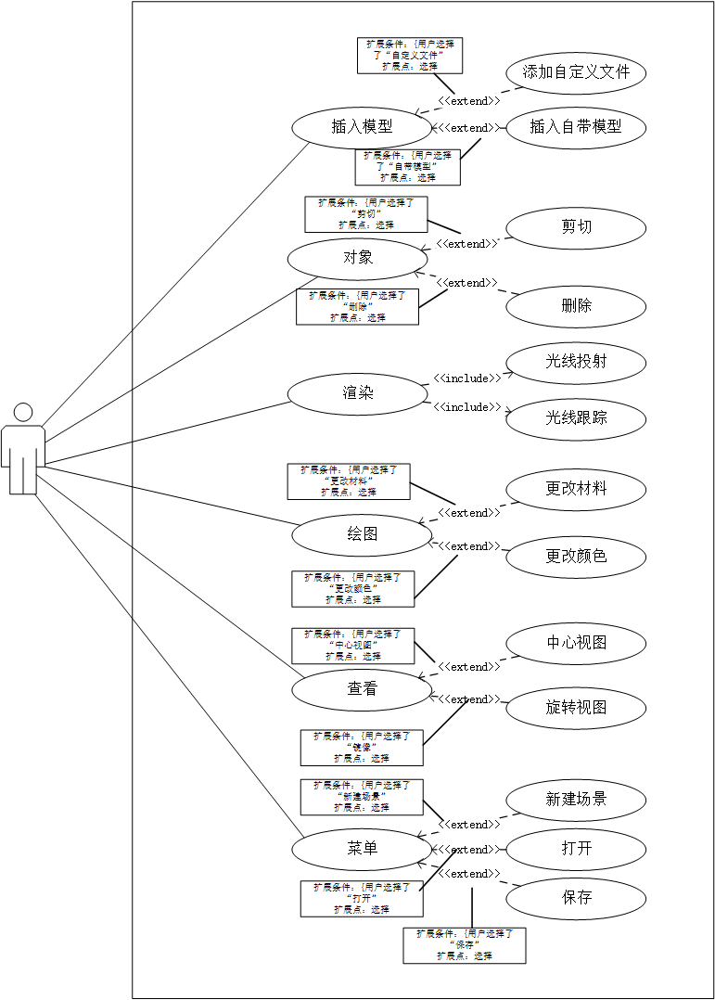

**插入**

用户点击插入按钮

选择（扩展点）{如果用户选择了自定义文件} extend 插入自定义文件

选择（扩展点）{如果用户选择了自带模型} extend 插入自带模型

**对象**

用户点击对象按钮

选择（扩展点）{如果用户选择了剪切} extend 剪切对象

选择（扩展点）{如果用户选择了删除} extend 删除对象

**渲染**

通过光线投射或光线追踪将模型渲染成更加接近真实物体的图像

**绘图**

用户点击绘图按钮

材料（扩展点）{如果用户选择了材料} extend 更换对象材料

颜色（扩展点）{如果用户选择了颜色} extend 更换对象颜色

**查看**

用户点击查看按钮

选择（扩展点）{如果用户选择了中心视图} extend 以中心查看对象

选择（扩展点）{如果用户选择了旋转视图} extend 对场景进行旋转，从不同角度观察对象

**菜单**

用户点击菜单按钮

选择（扩展点）{如果用户选择了新建场景} extend 新建场景

选择（扩展点）{如果用户选择了打开} extend 打开已有场景文件

选择（扩展点）{如果用户选择了保存} extend 保存当前场景

### 2.3用户特点

用户主要以高校学生为主，其次是商家。高校学生学习能力较强，能够较快地适应该软件，同时能够提出合理的改进意见。

操作与维护人员也均是在校学生，能够深入用户交流，便于调整软件功能，实现用户需求。

### 2.4假定与约束

进行本次开发工作的约束条件如下：

(1)开发时间短：仅有不足一个月的时间进行开发。

(2)人员技术水平有限：大部分成员没有相关的开发经验，在开发的过程中需要学习多种技术和能力。

本项目是否能够成功实施，主要取决于以下的条件：

(1)开发任务的合理分配

(2)团队成员的积极配合

## 3.具体需求

引入类图明确该项目中的角色分类及其角色间的相互联系。

### 3.1功能需求

#### 3.1.1首页

进入软件会立即弹出窗口，给予你两个选项：打开已有文件或者新建文件

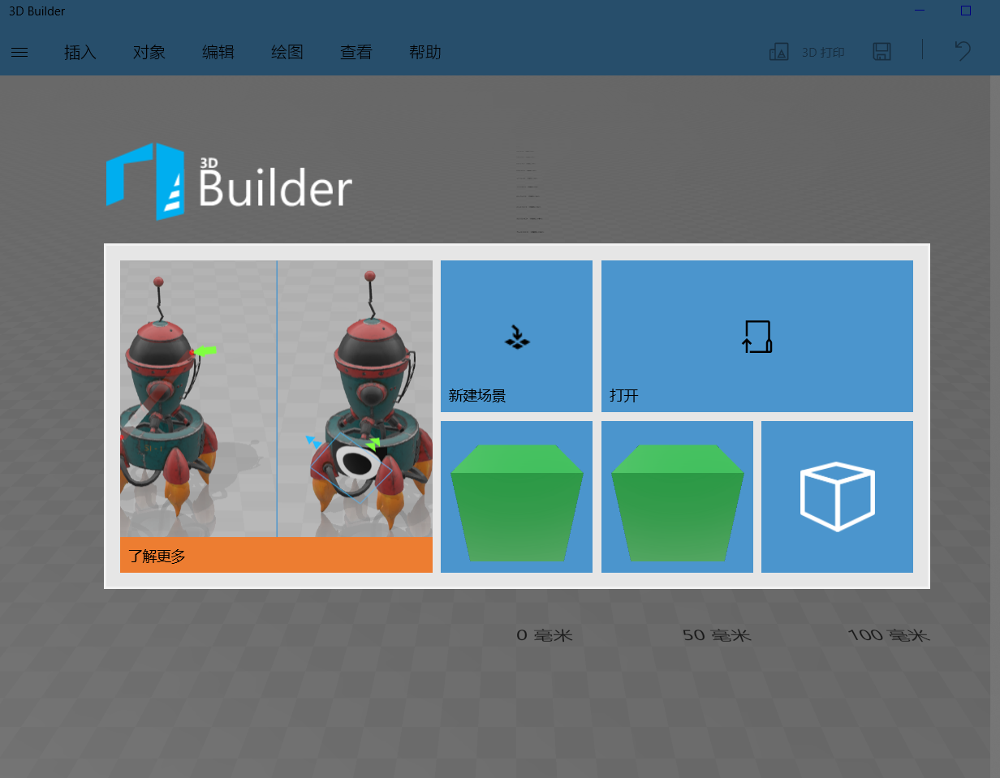

#### 3.1.2插入

插入分为两种情况，一种是插入自定义的3D模型；另一种就是插入系统自带的简单模型

**1）插入自定义模型**

插入自定义模型就是加载本地的3D模型文件，将该文件读入放置在场景当中

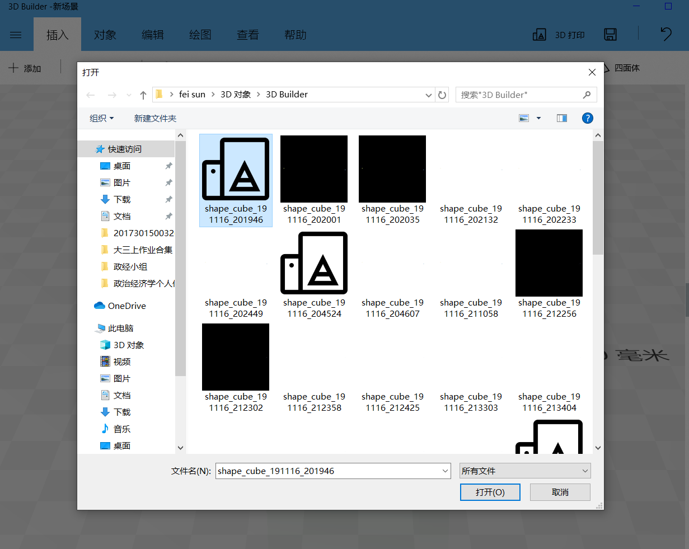

**2）插入系统自带的简单模型**

在一般的3D建模中，有一些几何体是经常使用的，为了用户使用更加方便，同时也可以让用户随心所欲地发挥他们的创意，所以该软件自带一些常用几何模型，比如说立方体等

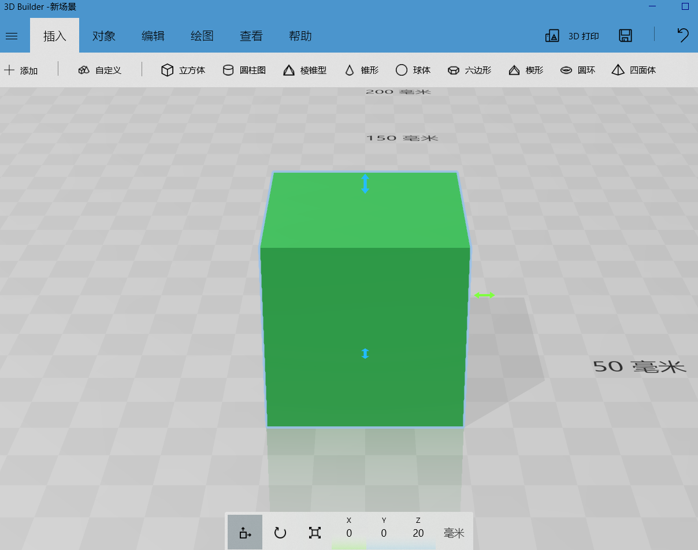

#### 3.1.3对象

在用户运用该软件进行创作时，我们把单个3D模型以及组合3D模型都可以看成对象，为了让用户可以随意修改他们的作品，我们对于对象有四个基本的操作：复制、剪切、粘贴、删除

**1）复制**

将对象进行复制，就是把对象复制到剪贴板等待下一步操作（被选中的对象不会消失），接下来可以选择粘贴也可以进行其他操作。

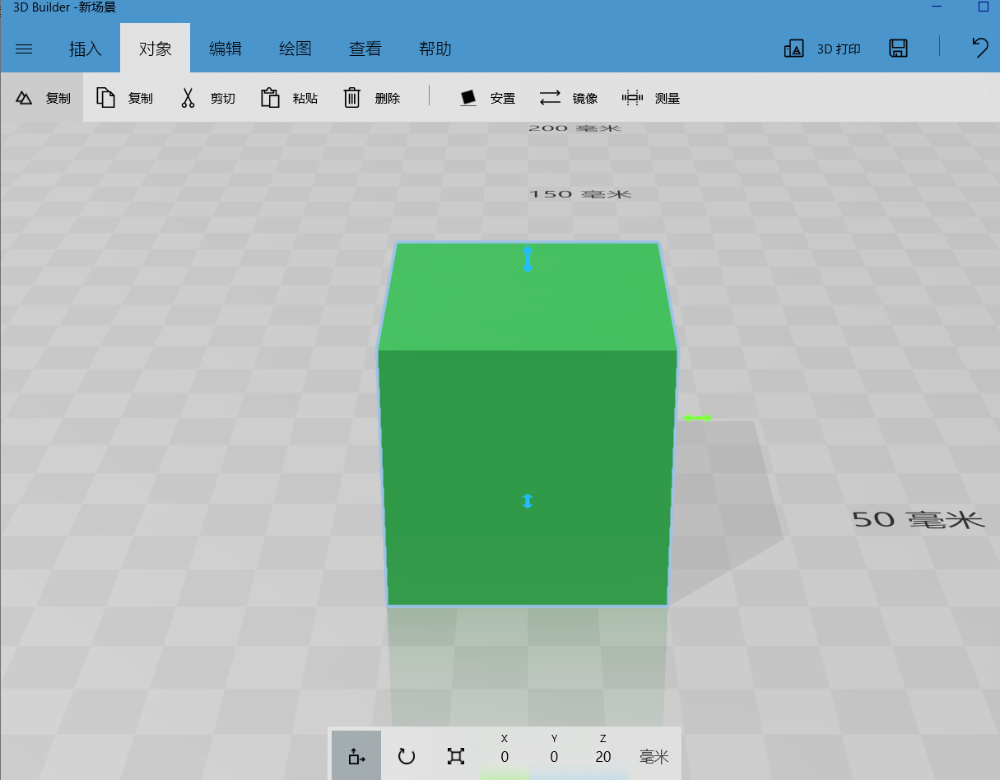

**2）剪切**

将对象剪切，也是把对象复制到剪贴板中等待下一步操作（被剪切的对象会在场景中消失），下一步操作只能选择粘贴操作。

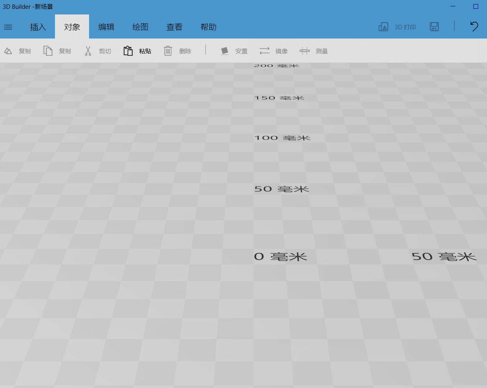

**3）粘贴**

将复制或者剪切到剪贴板中的3D模型粘贴到特定的位置。

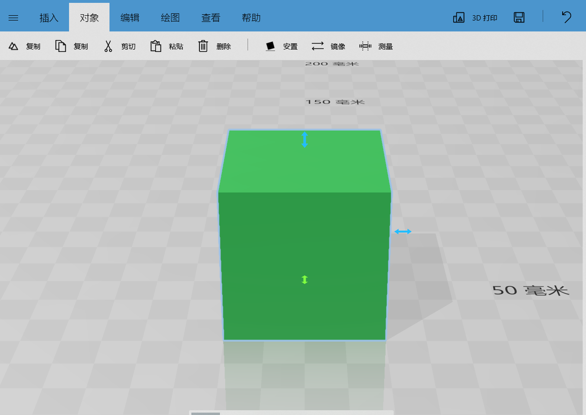

**4）删除**

将选中的对象在场景中消失

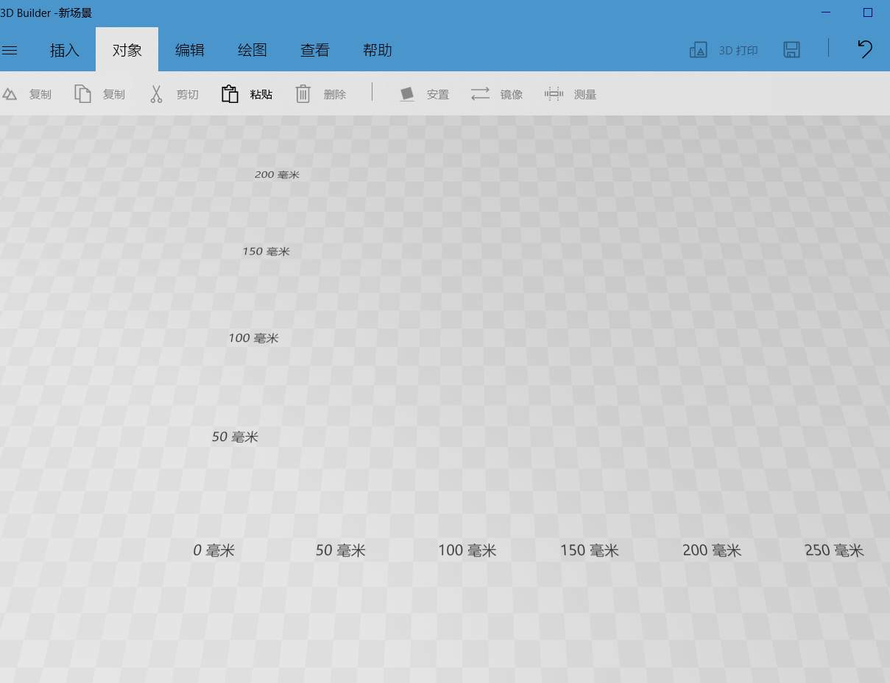

#### 3.1.4 编辑

对单个或者多个模型进行简单编辑，让模型达到预期的效果，这里只实现简单的编辑：改变材料、改变颜色、合并。

**1）改变材料**

这里我们可以选择的材料十分有限，仅有三种（磨砂，玻璃，金属），可以根据材质特点设定相应属性，例如：玻璃可设置其折射率。

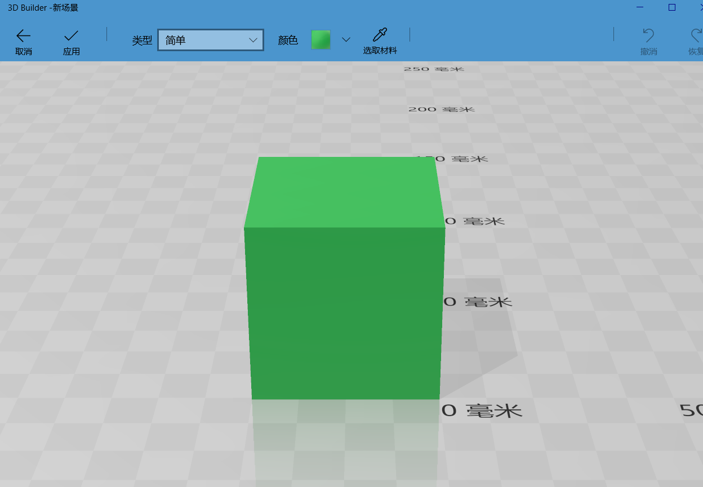

**2）改变颜色**

通过选择特定物体，并在上方编辑栏中修改其RGB颜色参数，可以选择多种颜色运用到模型表面。

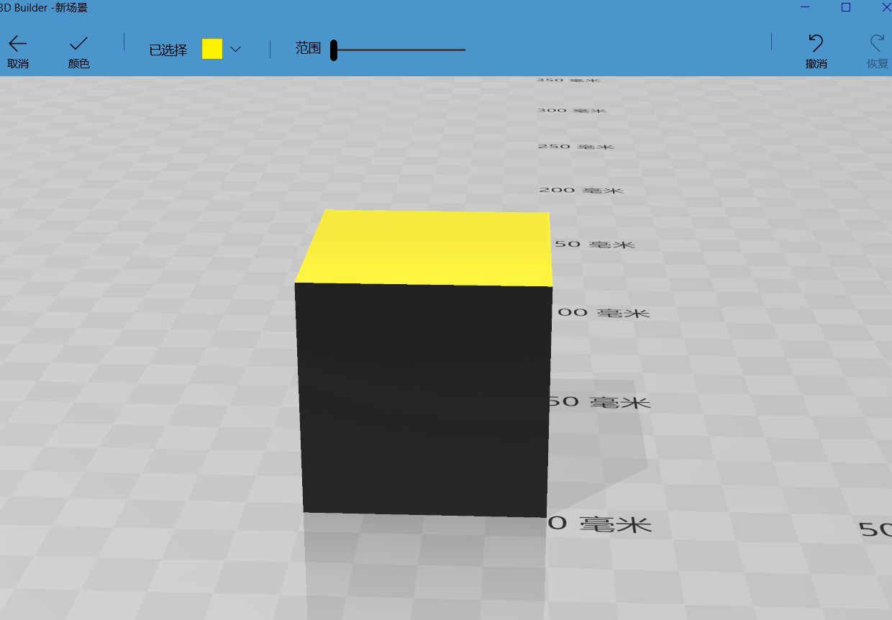

#### 3.1.5 查看

查看分为两个功能：中心视图，旋转视图

**1）中心视图**

将摄像头居于3D对象的中心位置

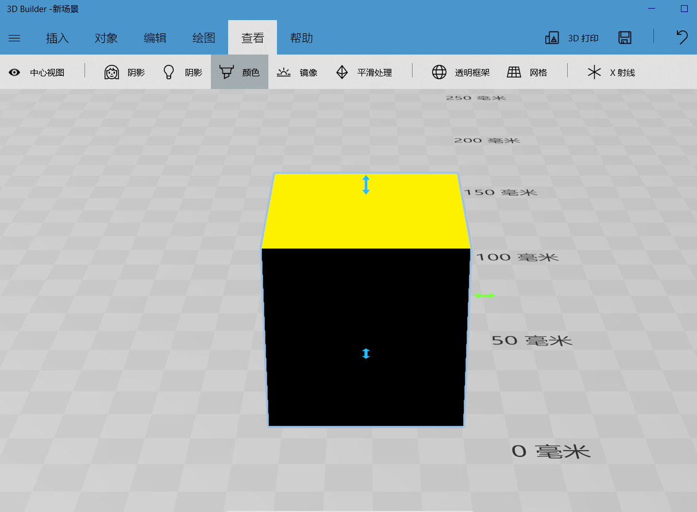

**2）旋转视图**

鼠标拖动模型显示界面，视野将随着鼠标拖动而旋转

### 3.1.6基本操作

这里基本操作包括保存和撤销（保存3D模型，撤销上一个操作）

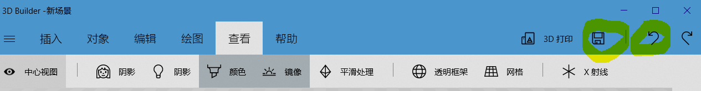

### 3.2性能需求

##### 3.2.1时间特性要求

及时响应，实时预览

##### 3.2.2灵活性

自适应屏幕大小的切换

### 3.3输入输出要求

输入：采用鼠标点击及拖拽

### 3.4数据管理能力要求

需要对用户自定义模型文件以及场景文件进行读取与保存。

### 3.5故障处理要求

服务器故障或是在上线用户体验的过程中根据用户的反馈需要增加功能时，提前向所有用户通过邮件的方式发送我们的维护信息。

### 3.6其他专门要求

暂无特殊要求。

## 4.运行环境规定

### 4.1设备

基本设备：个人计算机

其他要求：显卡：NVIDIA GeForce GTX 1050

### 4.2支持软件

操作系统：Windows 10

## 5.验收验证标准

#### 5.1 界面验收标准

| 序号 | 界面名称 | 界面描述及预期效果                                           |
| ---- | -------- | ------------------------------------------------------------ |
| 1    | 打开首页 | 中间出现弹出的窗口，一分为二的蓝色背景，左边显示“新建场景”、右边显示“打开” |
| 2    | 软件界面 | 最上方是一个菜单栏，依次为插入、对象、编辑、绘图、查看  。右上方是两个按钮，左边是一个保存按钮，右边是一个撤回按钮。 |
| 3    | 插入界面 | 点击菜单栏中的插入，下方依次显示“添加”按钮、"正方体"图标、”圆柱体“图标。点击“添加”按钮，弹出一个弹窗，左边会出现“加载对象”按钮，右边上方是文字“3D资源库”，下方是一系列3D模型图片。 |
| 4    | 对象界面 | 点击菜单栏中的对象，下方依次显示”复制“、“剪切”、“粘贴”、“删除”按钮。 |
| 5    | 编辑界面 | 点击菜单栏中的编辑按钮，下方依次显示“材料”和“颜色”按钮。点击“材料”按钮，最上方的菜单会被新的菜单栏覆盖，新的菜单栏从左到右依次是“取消”按钮、“应用”按钮、“类型”选择框、“颜色”选择框（选择框下拉会出现图片选项）。点击“颜色”按钮，最上方的菜单会被新的菜单栏覆盖，新的菜单栏从左到右依次是“取消”按钮、“应用”按钮、“颜色”选择框、"范围"选择条（选择可以从左往右滑动） |
| 6    | 查看界面 | 点击菜单栏的查看按钮，下方依次显示”中心视图“按钮。 |

#### 5.2 功能验收标准

| 序号 | 功能名称         | 详细操作                                                     | 预期效果                                                     |
| ---- | ---------------- | :----------------------------------------------------------- | ------------------------------------------------------------ |
| 0    | 打开软件         | 点击软件图标                                                 | 打开软件，软件弹出一个窗口，一分为二的蓝色背景，左边显示“新建场景”、右边显示“打开” |
| 1    | 插入自定义模型   | 点击”插入“按钮后，点击本地的自定义3D模型文件，选择打开       | 这个本地文件模型会出现在场景中                               |
| 2    | 插入系统自带模型 | 点击“插入”按钮后，点击在菜单栏有系统自带的立方体、圆柱体等按钮 | 会有相应的立方体、圆柱模型出现在场景中                       |
| 3    | 对象复制         | 点击“对象”按钮后，选择特定的模型对象，点击“复制”按钮         | 特定的模型对象会放置在粘贴板上                               |
| 4    | 对象剪切         | 点击“对象”按钮后，选择特定的模型对象，点击"剪切"按钮         | 被选中的模型对象会在场景中消失，同时该对象会放置在粘贴板上   |
| 5    | 对象粘贴         | 点击“对象”按钮后，点击”粘贴“按钮                             | 场景中会出现剪贴板上的3D模型                                 |
| 6    | 对象删除         | 点击“对象”按钮后，选择特定的模型对象，点击”删除“按钮         | 场景中被选中的模型对象会消失                                 |
| 7   | 改变表面材料     | 点击”绘图“按钮后，选择特定的模型对象，点击”材料“按钮，在”类型“选择栏中选择合适的类型，在”颜色“选择栏中选择合适的颜色，再点击"应用"按钮（若不想改变模型表面颜色，点击”取消“按钮） | 被选中的对象按照选择的”类型“和”颜色“修改了自身的表面材料（选择离开，返回”绘图“菜单栏） |
| 8   | 改变表面颜色     | 点击”绘图“按钮后，选择特定的模型对象，点击”颜色“按钮，在”颜色“选择栏选择合适的颜色，拖动”范围“移动条到合适的位置，再点击”应用“按钮。（若不想改变模型表面颜色，点击”取消“按钮） | 被选中的对象按照选择的”颜色“和”范围“修改了自身的表面颜色（选择离开，返回”绘图“菜单栏） |
| 9   | 中心视图处理     | 点击”查看“按钮后，选择一个或多个模型对象，再点击”中心视图“按钮 | 被选中的模型对象会移动到屏幕中央（模型本身在场景中的位置并不改变，只是视角转变了） |
| 10   | 旋转视图处理         | 选择某个物体对象后，鼠标拖动模型显示界面     | 视图将随着鼠标拖动而旋转                     |
| 11   | 保存文件         | 当完成3D模型创作，点击“保存”按钮，选择保存路径、文件格式，编辑文件名，再点击保存。 | 以特定的格式存储在电脑的特定位置                             |
| 12   | 撤销动作         | 当用户进行了一个错误的操作时，点击“撤销”按钮                 | 返回在这个操作之前的状态                                     |

## 6.未来预期

在达成现有目标的前提下，进一步完善已有功能，同时适当的增加少许功能（例如插入自定义的其它几何模型，实现调整对象大小、拉伸对象等），改善用户体验。

## 7.团队分工

技术总监：张永康

需求分析与原型设计：喻顺河，邱江，孙飞，陈项中

前端开发：任平安

后端开发：张永康，任平安，王锦润，陈麟轩

测试人员：孙飞，陈项中

文档编辑：喻顺河，邱江，孙飞，陈项中
