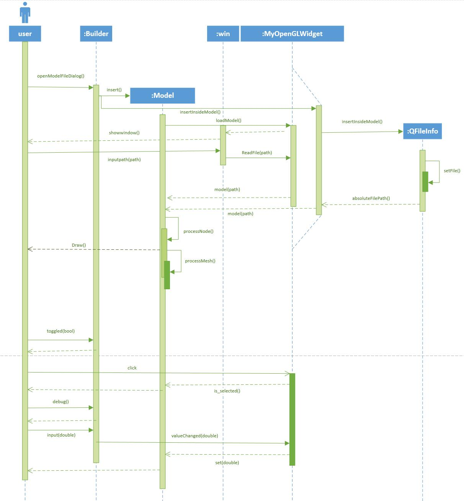

# 系统设计说明书

## 团队名称： 基于OpenGL的3D场景编辑器和基于CUDA并行加速的光线追踪渲染器 

## 完成时间： 2019/12/6

## 修订历史记录

| 日期       | 版本 | 说明                           |                       作者 |
| ---------- | ---- | ------------------------------ | -------------------------: |
| 2019.12.1 | V0.1 | 基本完成后端的类图分析。 | 张永康 |
| 2019.12.1 | V0.2 | 加入前、后端的类图。 | 张永康 |
| 2019.12.1 | V0.3 | 加入前、后端的活动图及分析。 | 张永康 |
| 2019.12.3 | V0.4 | 更新后端类图。 | 邱江 |
| 2019.12.3 | V0.5 | 添加后端类图说明。 | 邱江 |
| 2019.12.4 | V0.6 | 添加了后端的顺序图。|喻顺河|
| 2019.12.5 | V0.7 | 更新了前端类图。 |孙飞|
| 2019.12.5 | V0.8 | 添加前端类图说明 |孙飞|
| 2019.12.5 | V0.9 | 添加前端顺序图  | 陈项中 |

## 1. 类图

### 1.1 前端模块

1）builder:

- ui: OpenGL窗口
- openGLWidget:QT信号，调用则激活与信号绑定的函数，函数参数为信号传递的参数
- loadStyleSheet(widget: QWidget, styleSheetFile: QString)：对指定的widget对象为其加载样式表
- openModelFileDialog():打开一个文件对话框，获取模型文件的路径
- loadModelPath(path: QString):/发送模型文件的路径

2）ModelBase:模型基类,提供在OpenGL环境下各类模型可能共同需要的一些数据成员和操作

- id:模型id
- is_selected:用于判断对象是否被选中
- _vertices:模型顶点
- _indices:模型顶点索引
- _texture:模型纹理
- _VAO,_VBO,_EBO:模型缓冲
- Draw(program: QOpenGLShaderProgram, pick_mode: bool):调用进行绘制，需传入当前绘制程序
- void setUpModel():待定

3）Mesh类：网格类，描述模型对象中一个网格（由文件规定的逻辑分段）的数据

-  vertices:特殊的顶点,不能使用基类成员
-  textures:特殊的纹理数据，不能使用基类成员
-  AABB_Box[2]: AABB碰撞盒，0位为碰撞盒XYZ坐标最大值，1位为碰撞盒XYZ坐标最小值
-  mesh_id:Mesh类的ID号
-  Mesh(vertices: QVector<Vertex>, indices: QVector<unsigned int>, textures: QVector<Texture>):由model类调用，初始化每个网格

4)Model类:模型类，该类从文件中读取模型数据并存入缓存，由Draw方法启动绘制

- textures:模型纹理
- meshes:模型网孔，不是绘制出的面片，而是逻辑上的分段
- directory:模型文件所在文件夹目录
- path:模型文件所在绝对目录
- gammaCorrection:判断是否进行伽马校正
- AABB_Box[2]:0位为碰撞盒XYZ最大值点，1位为最小值点
- view_Center:模型碰撞盒中心点，用于“摆正”模型位置
- max_size:模型在x轴方向和y轴方向上碰撞盒大小的最大值
- model:模型世界坐标变换矩阵，所有对模型位置的操作都相当于对该矩阵的操作
- id:模型的id
- is_selected:判断对象是否被选中
- Move(ModelMoveState state):对象移动
- loadModel(QString path):由文件路径加载模型数据
- processNode(aiNode* node, const aiScene* scene):递归方法，递归获取模型每个node的数据
- processMesh(aiMesh* mesh, const aiScene* scene):递归方法，递归获取每个node中mesh的数据
- loadMaterialTextures(aiMaterial* mat, aiTextureType type, QString typeName):根据不同的纹理属性加载纹理，并存入模型纹理数组中，注意纹理不存进mesh类中

5)MyFloor:一个由灰色和白色网格组成的地板类，模型数据由程序动态生成

- grid_step: 网格大小
- grid_range:地板大小
- cameraPos:摄像机位置
- cameraPosChanged(QVector3D pos):当摄像机位置改变时调用此函数，此后将使用摄像机位置动态调整地板大小

6)SkyBox:天空盒类，该类从文件中提取天空盒图像并作为1x1天空盒显示

-  loadCubeMap():从文件中读取天空盒图像，其本质为加载图像成为立方体贴图

7)FuncTabWidget :每个Tab页下的狭长widget，只做了一些加载样式表的操作

- loadStyleSheet(const QString& styleSheetFile):加载样式表

8）TitleBar:自定义标题栏l类，可以更改颜色和功能按键的外观

- titleLabel:标题栏文字
- iconLabel:标题栏图标
- minButton:最小化按钮
- restoreButton:最大化按钮
- closeButton:关闭按钮
- lay:各控件的外层layout，将控件排列整齐
- win:父窗口指针
- isPressed:按钮是否按下（没有释放）
- startPos:鼠标按下时的坐标，之后当鼠标拖动时不更新，用于拖动窗
- InitializeWidget():初始化widget
- InitializeViews():初始化各控件样式
- mouseDoubleClickEvent(QMouseEvent *event)
  mousePressEvent(QMouseEvent *event)
  mouseReleaseEvent(QMouseEvent *event)
  mouseMoveEvent(QMouseEvent *event):对鼠标的一系列操作
- SetTitle(const QString &str):外部调用设置设置文字栏
- SetIcon(QPixmap &pix):外部调用设置图标
- ShowRestoreWindow():双击时最大化或返回正常大小
- ShowMaximizedWindow():最小化窗口
- ShowMinimizedWindow():最大化窗口
- CloseWindow():关闭窗口
- loadStyleSheet(const QString& styleSheetFile):加载格式文件

9）Picking Texture:封装有一个自定义帧缓冲的类，用于拾取

- FBO:帧缓存
- Init(unsigned int window_width, unsigned int window_height):初始化自定义帧缓存，若帧缓存已存在，则删除之前的新建帧缓存
-  EnableWriting():设置管线输出到自定义缓存中
- DisableWriting():设置管线输出到默认缓存
- ReadPixel(unsigned int x, unsigned int y):对给定的坐标读取相应位置上的数据

10)MyOpenGLWidget:OpenGL窗口，继承有Qt提供的OpenGL上下文API

- constexpr hash_t hash_compile_time(char const* str, hash_t last_value = basis):C++11新特性，可将字符串用于case
- insertInsideModel():添加内置模型，如正方体、圆柱等
- loadModel(QString path):由文件载入模型
- initializeGL():初始化OpenGL环境
- paintGL():绘制一帧
- ourModel:模型数组，存放各模型对象的数据
- lastMousePos:上一次鼠标事件的坐标
- printContextInformation():显示OpenGL信息
- deltaTime:用于记录两帧之间的时间间隔，可根据间隔动态调整摄像机移动速率以使移动平滑

11)Camera:相机类

- d_ptr:私有相机类
- setOrthographicProjection(float left, float right,float bottom, float top,float nearPlane, float farPlane):正交投影
- setPerspectiveProjection(float fieldOfView, float aspect,float nearPlane, float farPlane):中心投影
- setNearPlane(const float& nearPlane):近景观看
- setFarPlane(const float& nearPlane):远景观看
- setFieldOfView(const float& fieldOfView):设置观察视野
- setAspectRatio(const float& aspectRatio):设置纵横比
- setLeft(const float& left),setRight(const float& right),setBottom(const float& bottom),setTop(const float& top):左右，上下光线设置
- translate(const QVector3D& vLocal, CameraTranslationOption option = TranslateViewCenter):相对于摄影机方向轴平移
-  translateWorld(const QVector3D& vWorld, CameraTranslationOption option = TranslateViewCenter):相对于场景坐标轴平移
- tilt(const float& angle):偏航
- pan(const float& angle, const QVector3D& axis):俯仰
- roll(const float& angle):绕中心轴旋转
- zoom(const float& size):缩放

12）cameraprivate:相机私有类

-  updatePerpectiveProjection():刷新中心投影
- updateOrthogonalProjection():刷新正交投影

### 1.2 后端(渲染器)模块

关于上图中各类的说明如下：

hittable: 抽象类，代表一切可以被光线命中的物体

- center: 该物体的中心
- mat_ptr: 该物体的材质
- type: 该物体的类型
- copy_to_gpu(): 将当前对象拷贝到GPU显存中

bvh_node: BVH树结点
- left: BVH树左儿子指针
- right: BVH树右儿子指针
- obj_list: 当当前结点为叶节点时，此指针指向叶节点存储的线性表(其中包含若干物体)
- box: 该树结点被包围的AABB盒

hittable_list: 由各类模型实体构成的线性表
- list: 线性表指针
- list_size: 线性表大小

sphere: 球体
- radius: 球体半径

triangle: 三角形网格面
- v1: 三角形第一个顶点坐标
- v2: 三角形第二个顶点坐标
- v3: 三角形第三个顶点坐标
- vn1: 三角形第一个顶点的法向量
- vn2: 三角形第二个顶点的法向量
- vn3: 三角形第三个顶点的法向量
- normal: 在不开启Phong Shading时, 整个三角形面对应的法向量

camera: 摄像机
- origin: 摄像机的坐标
- lower_left_corner: 摄像机成像平面的左下角坐标
- horizontal: 摄像机成像平面的水平向量
- vertical: 摄像机成像平面的垂直向量
- u: 摄像机坐标系的第一个坐标轴向量
- v: 摄像机坐标系的第二个坐标轴向量
- w: 摄像机坐标系的第三个坐标轴向量
- lens_radius: 摄像机透镜半径

material: 抽象类，代表材质
- material_type: hittable类型的指针代表其子类类别
- copy_to_gpu(): 将当前对象拷贝到GPU显存中

lambertian: Lambertian漫反射材质，可简单理解为近似于磨砂塑料
- albedo: 三个颜色通道的反射率

metal: 金属材质
- albedo: 三个颜色通道的反射率
- fuzz: 表面粗糙度

dielectric: 玻璃材质
- ref_idx: 反射率

hit_record: 存储每次光线命中物体的记录的类
- p: 表示光线命中点的坐标
- t: 表示光线源点到命中点的距离
- normal: 表示命中点的物体表面法向量
- mat_ptr: 表示命中点的物体材质

hittable_type: 用于指示hittable类型的指针代表其哪种子类，由于CUDA中对虚函数不友好，因此用此枚举类型实现虚函数的功能

material_type: 用于指示material类型的指针代表其哪种子类，由于CUDA中对虚函数不友好，因此用此枚举类型实现虚函数的功能

ray: 光线
- A: 光线源点
- B: 光线法向量

Render: 渲染器
- nx: 渲染图像的宽
- ny: 渲染图像的高
- save_dir: 渲染图像的保存路径
- GetImage(): 根据本对象参数渲染并保存一张图像

vec3: 三维向量

在后端模块中，各类之间的关系如下：

- 抽象类hittable有四个子类：bvh_node、hittable_list、sphere、triangle，是对父类的不同具体实现，分别为BVH树结点、实体线性表、球体、三角网格面
- hittable_type类与hittable类一对一单向关联，用于指示 hittable类型的指针代表其哪种子类 
- hit_record类与hittable类一对多关联，用于记录每次光线命中的一个或多个物体
- ray类与hittable类多对多单向关联，表示可由多条光线同时照射多个物体
- Render类与hittable类一对多单向关联，表示可用一个渲染器对多个物体进行渲染
- 抽象类material有三个子类： lambertian 、metal、dielectric，是对父类的不同具体实现，分别为漫反射材质、金属材质、玻璃材质
- meterial_type类与material类一对一单向关联，用于指示 material类型的指针代表其哪种子类 
- material类与hittable类多对多关联，表示一个物体可由多种材质组成，一种材质也可用于多个物体
- camera类与hittable类一对多单向关联，表示可用一个摄像机对多个物体进行模-视变换，把物体顶点从对象坐标系变换到摄像机坐标系

## 2. 顺序图

### 2.1 前端顺序图

### 2.2 后端顺序图

## 3. 活动图

