# **测试分析报告**

# 1引言

## 1.1编写目的

在测试分析的基础上，进行测试后需要对测试的结果以及测试的数据等加以记录和分析总结，它是测试过程的一个重要的环节，同时，它也是对软件性能的一个总的分析和对认识不足的说明。为以后的软件开发程序提供了丰富的经验。

预期读者：软件开发者

## 1.2背景

1. 被测试软件系统的名称： 基于OpenGL的3D场景编辑器和基于CUDA并行加速的光线追踪渲染器 
2. 任务提出者：开发小组中扮演客户的学生
3. 开发者：开发小组
4. 用户：开发小组
5. 被测试环境与实际运行环境之间差异性小，测试准确性高

## 1.3参考资料

 1.《计算机软件产品开发文件编制指南》  GB 8567-88 Guidelines for computer software product development documentation 中华人民共和国国家标准UDC681.3

  2.《软件工程导论（第五版)》        作者：张海棠     清华出版社

  3.《软件测试与系统结构》              主编：金芝     机械工业出版社

# 2测试概要

### 2.1测试内容

| 测试内容             | 预期结果                                                     | 说明                       |
| :------------------- | ------------------------------------------------------------ | -------------------------- |
| 拾取模型             | 用户选择插入模型功能，可插入自定义的文件，也可插入软件自带的模型 | 软件应该支持多种自定义文件 |
| 移动模型             | 可对插入的对象进行粘贴，复制，剪切，删除四种操作             | 实现对象的基本操作         |
| 修改模型的颜色       | 可对3D模型实现了合并或者拆分结果                             | 保证结果正确               |
| 修改模型的材质       | 可实现更改3D模型的材料或者颜色                               | 保证效果的逼真             |
| 查看模型的中心视图   | 查看模型的中心视图                                           | 效果的好坏取决于实现的算法 |
| 查看模型的阴影效果   | 模型的阴影效果                                               | 效果的好坏取决于实现的算法 |
| 查看模型的镜像效果   | 模型的镜像效果                                               | 效果的好坏取决于实现的算法 |
| 新建场景             | 可成功新建场景                                               | 无                         |
| 打开一个场景         | 正确打开了场景                                               | 无                         |
| 保存一个设置好的场景 | 可成功保存场景                                               | 无                         |

### 2.2测试过程

测试人员：孙飞、邱江、喻顺河，陈项中

测试时间：2019年12月17日

测试环境：windows 10操作系统平台

| 测试内容       | 输入                                                     | 输出                         |
| -------------- | -------------------------------------------------------- | ---------------------------- |
| 渲染           | 点击渲染按钮                                             | 更加接近真实物体的图像       |
| 拾取模型       | 鼠标点击已经插入的3D模型                                 | 模型被正确拾取的结果         |
| 移动模型       | 在模型已经被拾取的情况下，按下键盘的上下左右移动键盘     | 模型成功的被移动             |
| 修改模型的颜色 | 点击颜色面板，在其中选择合适的颜色，对选中的物体进行应用 | 模型颜色的更改               |
| 修改模型的材质 | 选中模型后，移动反光度和透明度的滑动条                   | 模型的材质被正确修改         |
| 移动视角       | 对选中的模型，鼠标随意滑动                               | 模型的在各种视角下的状况     |
| 打开场景文件   | 一个已经存在的场景                                       | 成功打开之前已经存在过的场景 |
| 导入模型       | 软件中自带的3D模型                                       | 在场景显示已有自带的3D模型   |

## 2.3性能测试

测试人员：孙飞、邱江、喻顺河，陈项中

测试时间：2019年12月17日

测试环境：windows 10操作系统平台

测试：

| 测试内容                   | 预计结果 | 实际结果                                                     |
| -------------------------- | -------- | ------------------------------------------------------------ |
| 进入程序所需时间           | 10秒     | 15秒                                                         |
| 用户的任一操作软件响应时间 | 五秒内   | 对模型的拆分和合并，以及查看中心视图，阴影或者镜像效果响应时间较长，10秒左右 |

# 3测试结果及发现

## 3.1测试1（拾取）

| 标志符 | 输入                     | 预期结果                     | 实际结果                                           | 一致性   |
| ------ | ------------------------ | ---------------------------- | -------------------------------------------------- | -------- |
| 拾取   | 鼠标点击已经插入的3D模型 | 该模型状态变为已被选中的状态 | 该模型中的外围线条变为蓝色，显示这个模型已经被选中 | 完全一致 |

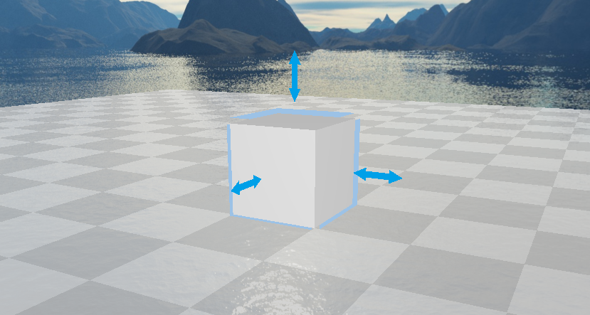

## 3.2测试2（移动）

| 标志符 | 输入                                                 | 预期结果                     | 实际结果                   | 一致性   |
| ------ | ---------------------------------------------------- | ---------------------------- | -------------------------- | -------- |
| 移动   | 在模型已经被拾取的情况下，按下键盘的上下左右移动键盘 | 模型会按照按下键盘的方向移动 | 模型按照指定的方向匀速运动 | 完全一致 |

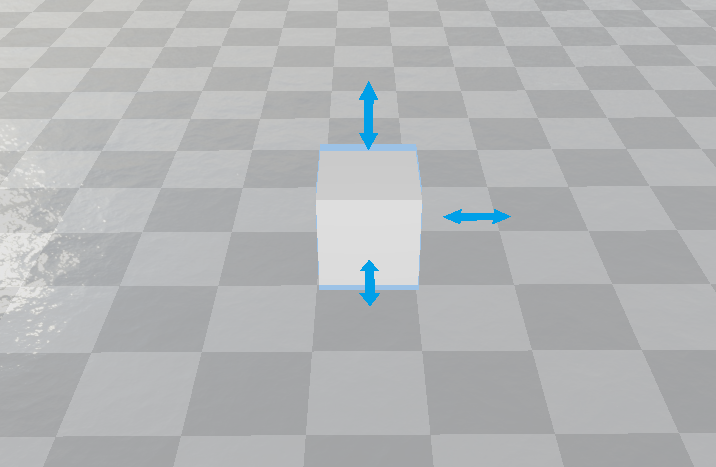

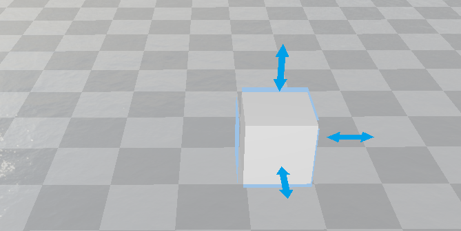

物体由上图中的位置向右移动一个单位距离到下图位置

## 3.3测试3（打开场景文件）

| 标志符       | 输入                                                         | 预期结果                                     | 实际结果                     | 一致性   |
| ------------ | ------------------------------------------------------------ | -------------------------------------------- | ---------------------------- | -------- |
| 打开场景文件 | 点击insert按钮，然后到个人电脑文件夹中选择文件打开（这里我们的是文件名为aaa打开） | 选择打开的文件在场景中打开，显示其原本的模样 | 场景中显示出一个红色的立方体 | 完全一致 |

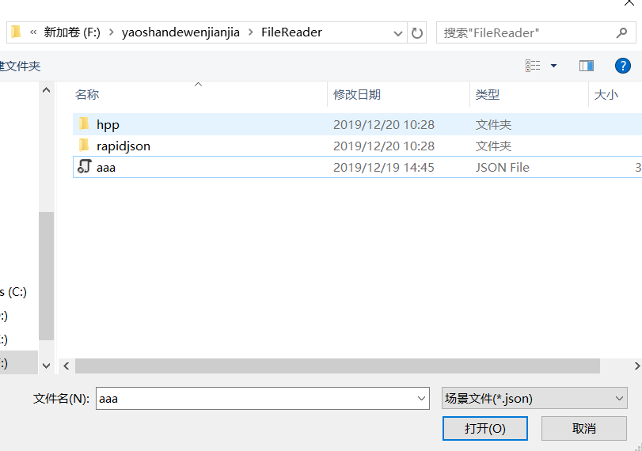

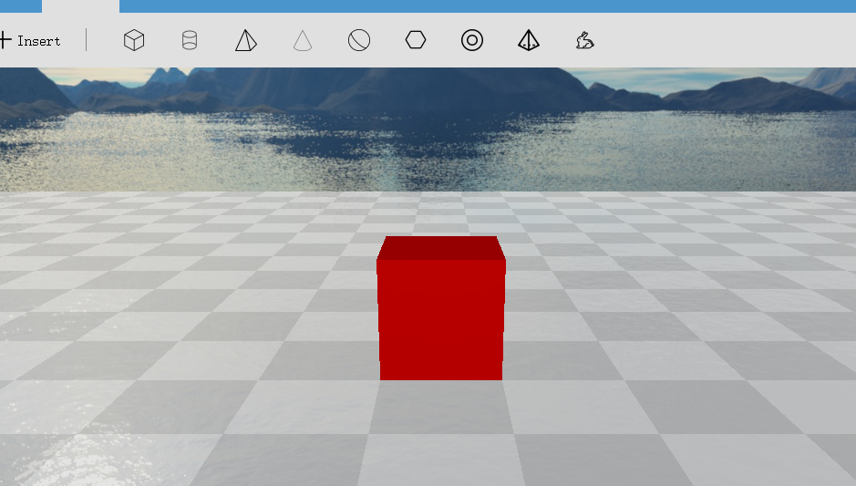

从上图中文件夹中选择一个3D模型文件，打开，就呈现出下图的场景

## 3.4测试4（修改颜色）

| 标志符   | 输入                                                         | 预期结果                   | 实际结果                 | 一致性   |
| -------- | ------------------------------------------------------------ | -------------------------- | ------------------------ | -------- |
| 修改颜色 | 点击颜色面板，在其中选择合适的颜色，对选中的物体进行应用（这里应用的颜色为红色） | 选中的物体表面变成新的颜色 | 选中的模型由黄色变为红色 | 完全一致 |

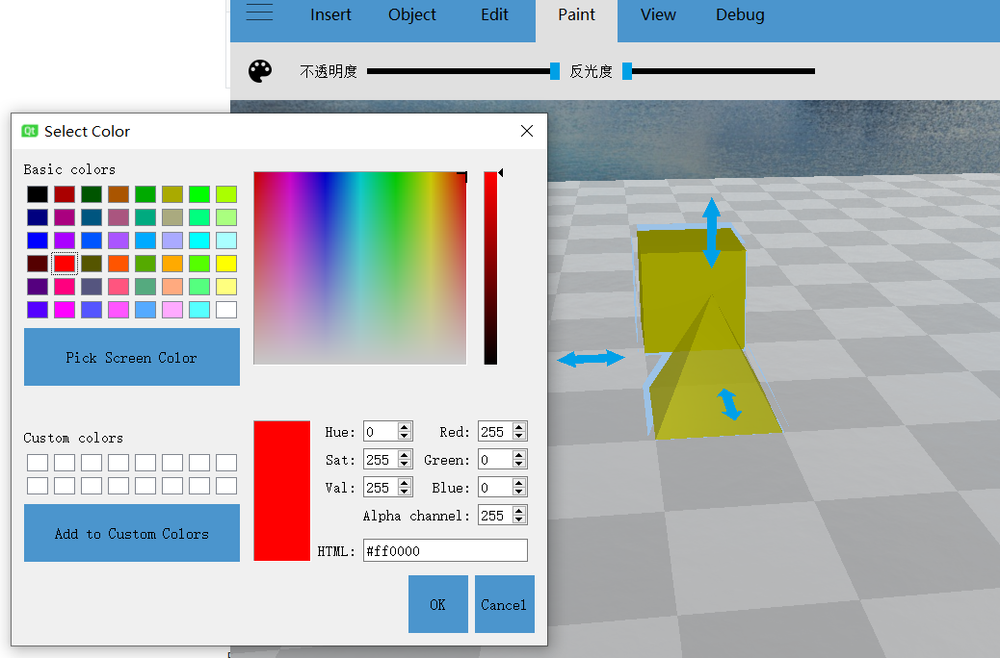

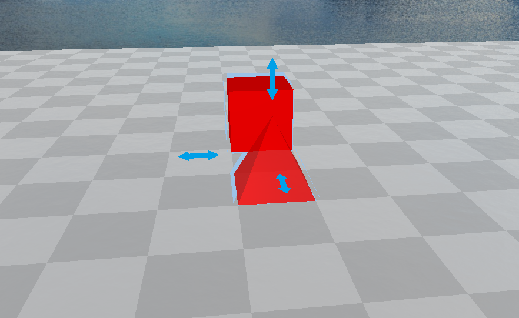

在调色板中选择红颜色应用到选中的模型上，两个模型都变成红颜色表面。

## 3.5测试5（修改材质）

| 标志符   | 输入                                                   | 预期结果               | 实际结果           | 一致性   |
| -------- | ------------------------------------------------------ | ---------------------- | ------------------ | -------- |
| 修改材质 | 选中模型后，移动反光度和透明度的滑动条（从最低到最高） | 模型表面材质会完全改变 | 模型变成了玻璃材质 | 完全一致 |

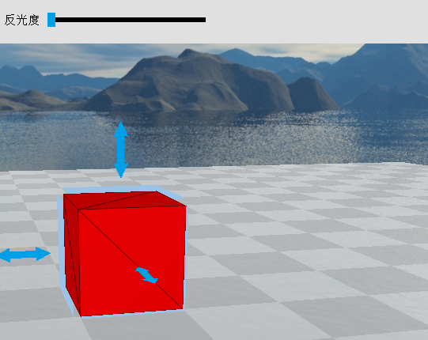

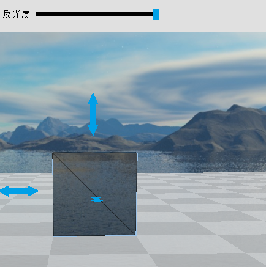

这里我们调控反光度，就使得材质变为玻璃。

## 3.6测试6（移动视角）

| 标志符   | 输入                                       | 预期结果                         | 实际结果         | 一致性   |
| -------- | ------------------------------------------ | -------------------------------- | ---------------- | -------- |
| 移动视角 | 对选中的模型，鼠标随意滑动（鼠标向下移动） | 会从另一个不同的视角看到这个模型 | 会形成俯视的视角 | 完全一致 |

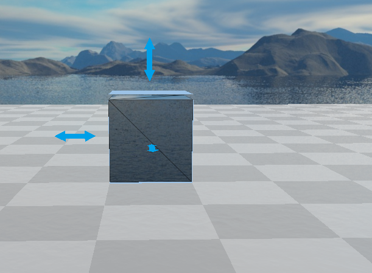

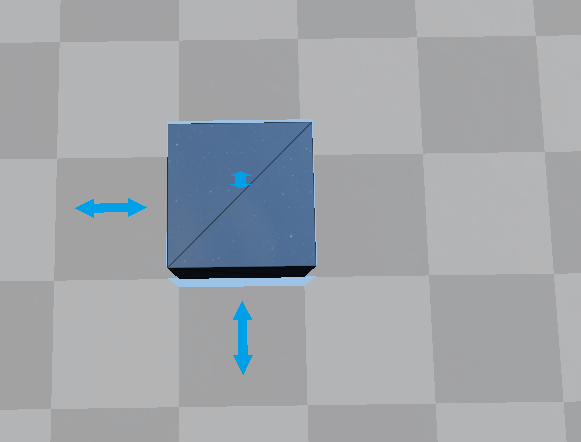

选中模型后，鼠标一直向上移动，视角从正视变为俯视

## 3.7测试7（导入模型）

| 标志符   | 输入                                             | 预期结果             | 实际结果                 | 一致性   |
| -------- | ------------------------------------------------ | -------------------- | ------------------------ | -------- |
| 导入模型 | 点击insert菜单下一系列模型图标（点击正方体图标） | 场景会导入相应的模型 | 场景中央出现白色的长方体 | 完全一致 |

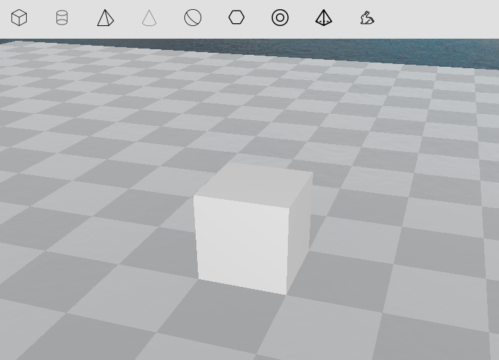

导入默认颜色为白色的正方体

## 3.8测试8（模型渲染）

| 标志符   | 输入                                     | 预期结果                         | 实际结果             | 一致性   |
| -------- | ---------------------------------------- | -------------------------------- | -------------------- | -------- |
| 模型渲染 | 对已经选中的模型，点击上方最右边渲染图标 | 模型会变得和实际物理场景更加贴近 | 模型变得更加有真实感 | 完全一致 |

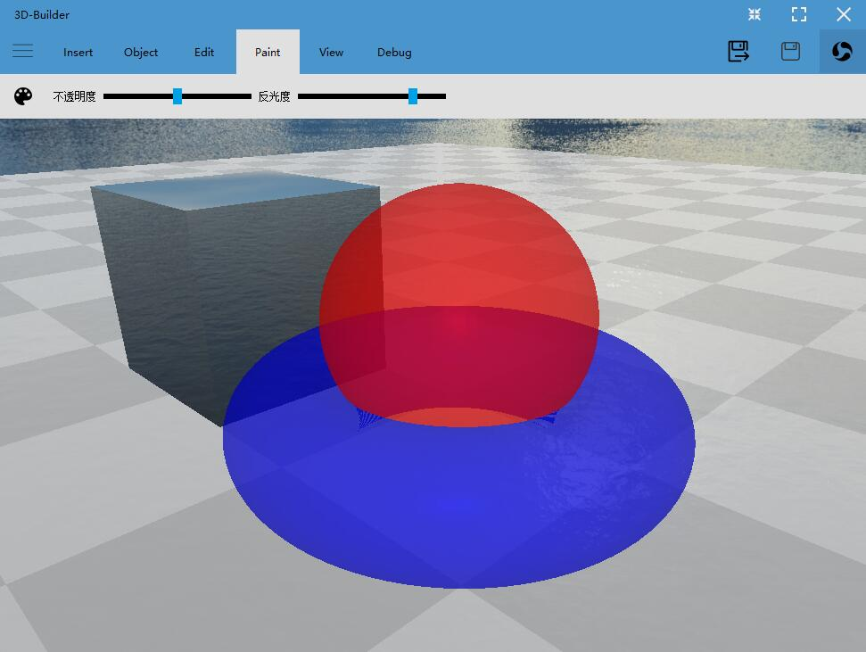

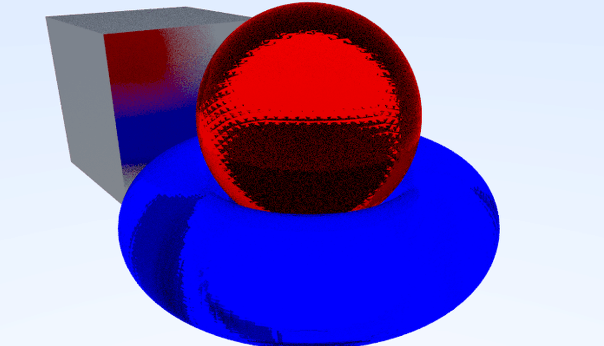

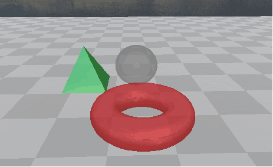

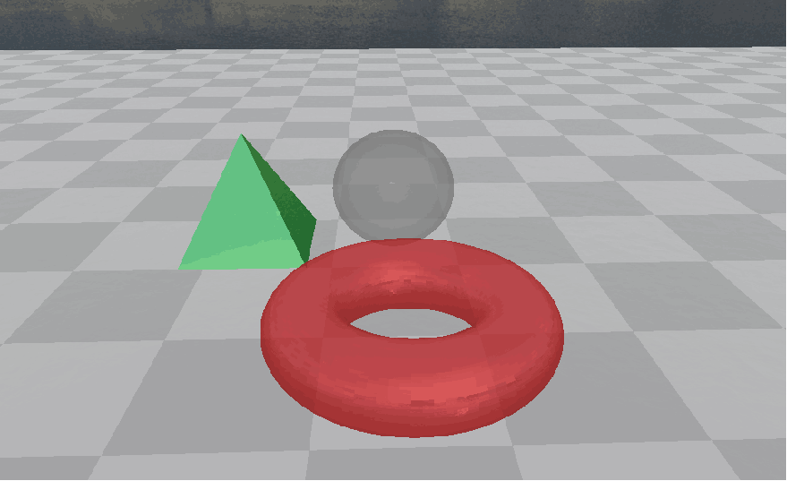

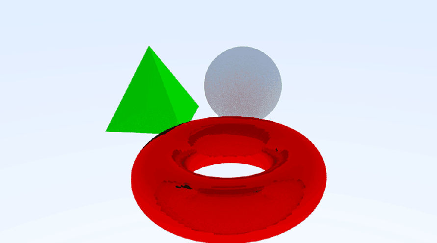

两个例子显示渲染效果很明显，使得模型更加逼真。

## 3.9性能测试综述

打开软件大约需要5秒，比预计的更短更快；不同的操作响应时间有细微差别，尤其是渲染操作，要求较长时间，基本符合预期效果。

# 4对软件功能的结论

## 4.1功能1（标识符）

### 4.1.1能力

a.拾取，在object中点击选择对象后，可通过鼠标点击拾取目标物体，物体附近显示虚化物像，表示拾取物体成功

b.移动，拾取目标物体后，可通过键盘方向键进行物体的移动。

c.打开场景文件，点击insert，选择.json文件后确定，可在程序中打开场景文件

d.修改颜色，点击paint中形似调色板的图标后可打开窗口，对拾取的物体进行颜色的改变，在对颜色进行选取时可使用取色笔功能，或者直接输入rgb值进行调整

e.修改材质，在paint中拖拉不透明度和反光度的拖拉条，可对拾取的物体进行材质的改变

f.移动视角，按住鼠标左键移动鼠标进行视角的移动，按住鼠标右键移动鼠标可移动视角的焦点，滚动鼠标滚轮可进行视角的拉伸

### 4.1.2限制

局限性：无法使用鼠标进行物体的拖拽移动，只能用键盘让其移动，给用户带来小小的不方便。

# 5分析摘要

## 5.1能力

在程序中插入3d物体，点击物体可进行物体的选取，为方便观察可进行视角的移动。可调整3d物体的颜色，不透明读和反光度，拾取物体后可使用方向键对物体进行移动，多个物体可使之重叠，本程序中无物体间的物理碰撞

## 5.2缺陷和限制

a.渲染太慢

b.无法设置光源

c.不能进行模型缩放

## 5.3建议

a． 对算法进行调整以提高渲染速度

b． 无法放置光源和不能进行模型缩放的缺陷对于程序来说问题不大，可在时间充足的情况下加入此功能

## 5.4评价

软件的开发已达到预期效果，并且能交付使用，但是其中有些功能还不完善，需要进行改进。

缺点：渲染速度较慢。

优点：能够兼容插入的各个物体模型，物体表面能够对环境光进行符合物理规律的反射。

# 6测试资源消耗

该测试消耗了大概一星期的时间，小组中所有成员对程序进行测试，并持续给开发人员反馈。